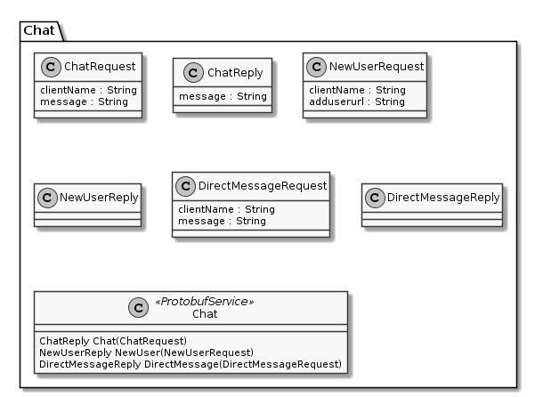

# Protobuf2UmlViceVersa

Creates UML Models from Protobuf files.  
Converting UML Model to Protobuf will be added later.

## Version
The project is in a incomplete state.  
You can only run the unit tests to see some output

## Workflow
1. Write your proto files.
2. Run Proto-Compiler to create a compiled model.
   ```batch
   protoc "C:\Directory\mymodel.proto" --proto_path="C:\Directory" --descriptor_set_out="mymodel"
   ```
3. Run Protobuf2UmlViceVersa to get an UML Model,
4. Run any UML Exporter to output the UML Model to a format of your choice.

## Exporter
Currently only PlantUML Exporter exists. It is the easiest way to print some pretty UML Models.
Outputs directly to the console. The output can only be seen in unit tests now.

## Example
```protobuf
syntax = "proto3";

option csharp_namespace = "GrpcServer.Protos";

package Chat;

service Chat {
  rpc Chat (stream ChatRequest) returns (stream ChatReply) {}
  rpc NewUser (NewUserRequest) returns (NewUserReply) {}
  rpc DirectMessage (DirectMessageRequest) returns (DirectMessageReply) {}
}

message ChatRequest {
	string clientName = 1;
	string message  = 2;
}

message ChatReply {
	string message  = 1;
}

message NewUserRequest {
	string clientName = 1;
	string adduserurl  = 2;
}

message NewUserReply {
}

message DirectMessageRequest  {
	string clientName = 1;
	string message  = 2;
}

message DirectMessageReply {
}
```


